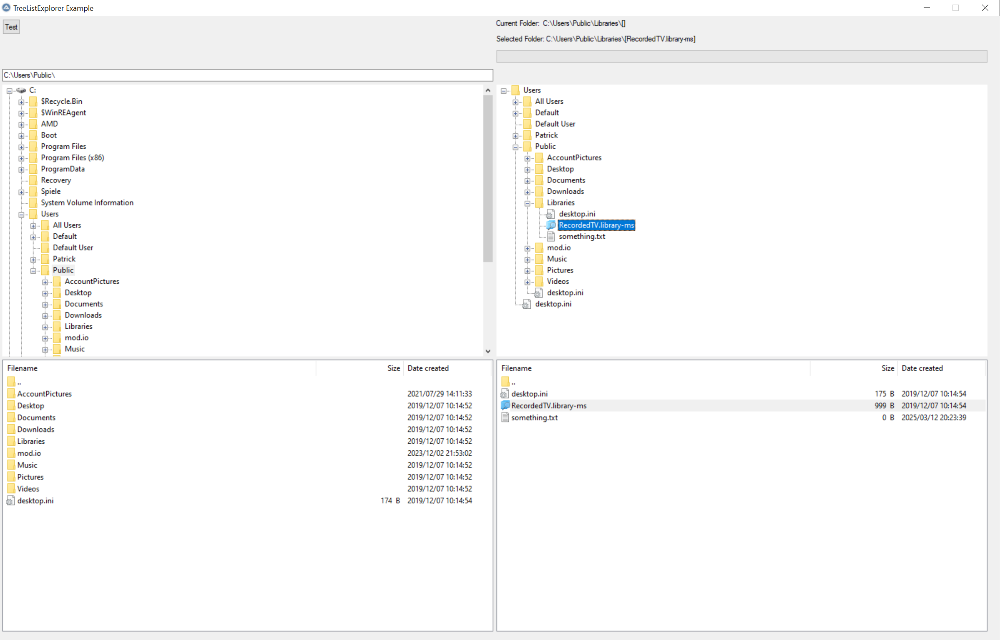

# TreeViewExplorer UDF for AutoIt

This is a UDF (User defined functions) library for AutoIt, enabling the simple use of ListView/TreeView/Input controls to navigate folders and files.

It allows the user to create a TreeListExplorer system (TLE system; __TreeListExplorer_CreateSystem), which is used to define a root directory, the currently opened folder, a possibly selected folder/file and more.\
To this system any TreeView/ListView/Input controls can be added as view (__TreeListExplorer_AddView), which are then synchronized to show the current folder and automatically updated when the TLE system is changed.

Screenshot of the ([Code Example](TreeListExplorer-Example.au3)):
